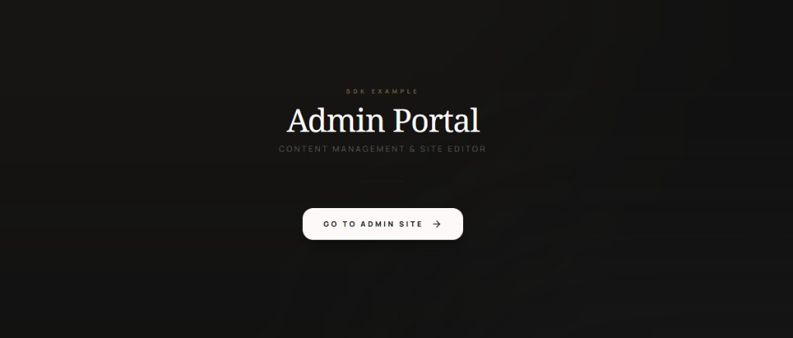

# artist-portal-sdk Monorepo



This repository contains:

- `packages/artist-portal-sdk`: reusable SDK for Firebase bootstrap, Firestore content reads, shared domain types, and optional admin UI entrypoint.
- `apps/sdk-example`: example Vite app that consumes the SDK.


## Workspace Layout

- `packages/artist-portal-sdk/` publishable SDK package
- `apps/sdk-example/` SDK integration example app
- `firestore.rules` Firestore security rules
- `firebase.json` Firebase CLI hosting/rules config

## Prerequisites

- Node.js 20+
- [pnpm](https://pnpm.io/) (Corepack recommended: `corepack enable`)

## Install

```bash
pnpm install
```

## Common Commands

### SDK package

- Build SDK only: `pnpm run build:sdk`

### Example app (`apps/sdk-example`)

- Dev (production target mode): `pnpm run dev:sdk`
- Dev (release target mode): `pnpm run dev:sdk:release`
- Build SDK + example app (production mode): `pnpm run build:sdk:dev`
- Build SDK + example app (release mode): `pnpm run build:sdk:release`

### Client app helpers (optional)

- Build selected client app: `pnpm run build:client:dev`
- Build selected client app release: `pnpm run build:client:release`
- Dev selected client app: `pnpm run dev:client`
- Dev selected client app release: `pnpm run dev:client:release`

Use `CLIENT_APP=<pnpm-package-name>` to choose a specific client app for the client scripts.

## Firebase Targets

This repo supports two Firebase targets:

- `production`
- `release`

Target selection is controlled by Vite mode and/or `VITE_FIREBASE_TARGET`.

## Deploy Commands

- Firestore rules (production): `pnpm run deploy:rules:production`
- Firestore rules (release): `pnpm run deploy:rules:release`
- Hosting (production): `pnpm run deploy:hosting:production`
- Hosting (release): `pnpm run deploy:hosting:release`
